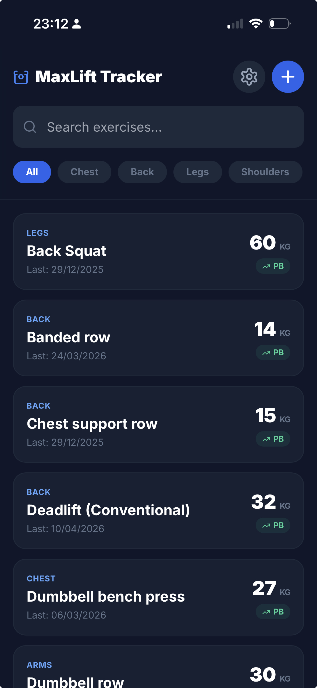
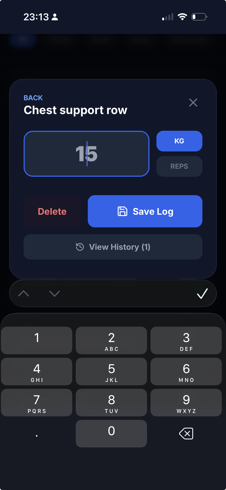

# MaxLift Tracker

MaxLift Tracker is a mobile-friendly web application designed to help you track your weightlifting progress and personal bests. It is designed to be saved to your home screen as a Progressive Web App (PWA).

## Features

- **Exercise Tracking:** Log your current weight and reps for various exercises.
- **Personal Bests:** Automatically tracks and highlights your maximum weight for each exercise.
- **Categorization:** Organize exercises by muscle group (Chest, Back, Legs, Shoulders, Arms, Core, Other).
- **History Log:** View a detailed history of your logs for each exercise.
- **Search:** Quickly find exercises by name.
- **PWA Ready:** Prompts users to add to home screen for an app-like experience.
- **Data Portability:** Export and import your data as JSON files for backup and restore.

## Screenshots

*(You can add the screenshots you provided in the chat by saving them to an `assets` folder and updating the links below)*

### Main Screen


### Exercise Log & History


## Getting Started

### Prerequisites

- Node.js (v18 or higher recommended)
- npm

### Installation

1. Clone the repository:
   ```bash
   git clone https://github.com/weissli/MaxLift.git
   ```
2. Navigate to the project directory:
   ```bash
   cd MaxLift
   ```
3. Install dependencies:
   ```bash
   npm install
   ```

### Running Locally

To start the development server:
```bash
npm run dev
```
The app will be available at the port specified by Vite (usually `http://localhost:3000` or similar).

### Building for Production

To build the static files for production:
```bash
npm run build
```
The output will be in the `dist/` directory.

### Deployment

The project includes a `deploy.sh` script for deploying via FTP.
Configure your FTP details in a `.env.deploy` file:
```env
FTP_HOST="your-ftp-host.com"
FTP_USER="your-username"
FTP_PASS="your-password"
REMOTE_DIR="your-remote-directory"
```
Then run:
```bash
./deploy.sh
```

## Testing

Tests are written using Vitest. To run the tests:
```bash
npx vitest run
```
